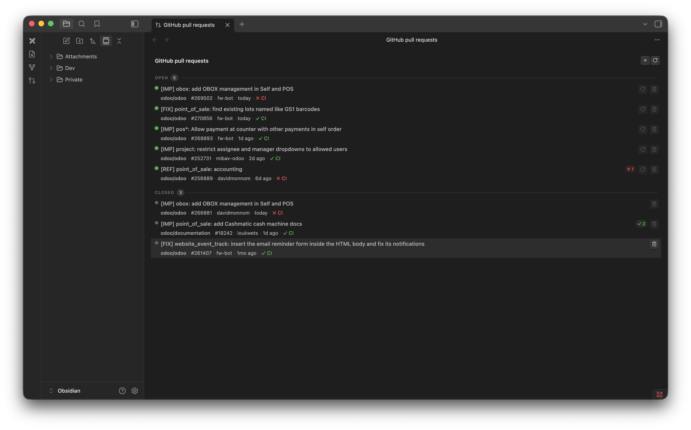

# Github PR Tracker

An Obsidian plugin that tracks GitHub pull requests in a sidebar panel.
Keep an eye on your open reviews without leaving your notes.

The CI feature is optimized for custom CI pipelines that report
their status to github.

## Features

- **Sidebar panel** — dedicated view listing all tracked PRs grouped by status (Open / Closed)
- **Per-PR details** — title, repo, PR number, author, last updated, and review status at a glance
- **Review pills** — shows approved / changes-requested / pending review counts inline
- **CI status** — displays the combined commit status from your CI system (success / failure / pending)
- **Quick actions** — refresh or remove individual PRs directly from the list
- **Secure token storage** — GitHub personal access token is stored in the system keychain via Obsidian's secret storage, never written to disk

## Usage

Paste any GitHub PR URL in the format `https://github.com/owner/repo/pull/123`.

- **Refresh** a single PR with the rotate icon on its row (open PRs only).
- **Refresh all** open PRs with the rotate icon in the panel header.
- **Remove** a PR from tracking with the trash icon on its row.

Closed PRs are kept in the list for reference but are never auto-refreshed.
